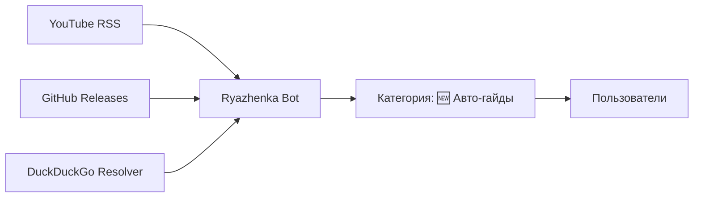

<div align="center">

# 🎮 Ryazhenka Helper Bot

### *Your Ultimate Nintendo Switch Modding Guide Assistant*

[](https://telegram.org/)
[](https://www.python.org/)
[](LICENSE)

*Автоматизированный Telegram-бот для поиска, синхронизации и управления гайдами по моддингу Nintendo Switch*

[Features](#-возможности) • [Quick Start](#-быстрый-старт) • [Commands](#-команды) • [Deploy](#-деплой-на-railway) • [Security](#-безопасность)

</div>

---

## 📖 Описание

**Ryazhenka Helper Bot** — это интеллектуальный Telegram-бот, созданный для энтузиастов моддинга Nintendo Switch. Бот автоматически собирает, структурирует и предоставляет доступ к проверенным гайдам из YouTube и GitHub, делая процесс поиска информации максимально простым и удобным.

### 🎯 Для кого этот бот?

- 🔧 Разработчиков homebrew-приложений для Switch
- 🎮 Энтузиастов кастомной прошивки и моддинга
- 📚 Сообществ, нуждающихся в централизованной базе знаний
- 🤖 Тех, кто ценит автоматизацию и структурированную информацию

---

## ✨ Возможности

<table>
<tr>
<td width="50%">

### 🔍 Умный поиск
- **Fuzzy-поиск** с использованием `fuzzywuzzy`
- Поддержка опечаток и неточных запросов
- Мгновенные результаты по ключевым словам
- Поиск на русском и английском языках

### 🔄 Автоматическая синхронизация
- **YouTube RSS** — новые видео-гайды
- **GitHub Releases** — обновления через Atom
- Фоновый резолвер DuckDuckGo
- Автоматическая категоризация контента

</td>
<td width="50%">

### 🛠️ Инструменты администратора
- Принудительная синхронизация (`/sync`)
- Очистка и архивация (`/purge_autoguides`)
- Управление категориями
- Модерация контента

### 🚀 Простой деплой
- Готовая конфигурация для **Railway**
- Health endpoint для мониторинга
- Поддержка переменных окружения
- Минимальная настройка

</td>
</tr>
</table>

---

## 🚀 Быстрый старт

### Предварительные требования

- Python 3.9 или выше
- Telegram Bot Token (получить у [@BotFather](https://t.me/botfather))
- Git

### 📥 Установка

```bash
# 1. Клонируйте репозиторий
git clone https://github.com/Dimasick-git/Ryazhenka_Bot.git
cd Ryazhenka_Bot

# 2. Создайте виртуальное окружение
python -m venv .venv

# Windows
.venv\Scripts\activate

# Linux/macOS
source .venv/bin/activate

# 3. Установите зависимости
pip install -r requirements.txt

# 4. Настройте переменные окружения
cp .env.example .env
# Отредактируйте .env и добавьте ваш BOT_TOKEN

# 5. Запустите бота
python main.py
```

### ✅ Проверка запуска

При успешном старте вы увидите:

```
🤖 Бот запущен и готов к работе!
📚 Загружено X категорий
```

---

## 📋 Команды

### 👥 Пользовательские команды

| Команда | Описание | Пример |
|---------|----------|--------|
| `/start` | Приветствие и отображение категорий | `/start` |
| `/all` | Список всех категорий с количеством гайдов | `/all` |
| `/guide <тема>` | Fuzzy-поиск гайда по теме | `/guide atmosphere` |
| `/гайд <тема>` | Русскоязычный алиас для `/guide` | `/гайд атмосфера` |
| `/recommend` | Рекомендуемые репозитории автора | `/recommend` |

### 🔐 Администраторские команды

> **Примечание:** Доступны только пользователям из `ADMIN_IDS`

| Команда | Описание | Действие |
|---------|----------|----------|
| `/sync` | Принудительная синхронизация | Обновляет базу из YouTube и GitHub |
| `/purge_autoguides` | Архивация авто-гайдов | Перемещает `🆕 Авто-гайды` в `Архив` |
| `/cleanup` | Очистка дубликатов | Удаляет повторяющиеся записи |

---

## 🔧 Как работает автоматизация

### 📡 Источники данных



### 🤖 Процесс автодобавления

1. **Мониторинг источников** — бот периодически проверяет RSS/Atom фиды
2. **Парсинг контента** — извлекает ссылки и метаданные
3. **Резолвинг ссылок** — DuckDuckGo преобразует короткие ссылки в прямые
4. **Фильтрация** — проверяет домены из белого списка
5. **Категоризация** — автоматически добавляет в `🆕 Авто-гайды`
6. **Уведомления** — (опционально) оповещает администраторов

---

## 🌐 Деплой на Railway

### Шаг 1: Подготовка

1. Форкните этот репозиторий
2. Создайте аккаунт на [Railway.app](https://railway.app/)
3. Получите Bot Token у [@BotFather](https://t.me/botfather)

### Шаг 2: Деплой

```bash
# Railway автоматически обнаружит Python проект
# и установит зависимости из requirements.txt
```

### Шаг 3: Настройка переменных

В Railway Dashboard добавьте:

| Переменная | Описание | Обязательно |
|------------|----------|-------------|
| `BOT_TOKEN` | Telegram Bot Token | ✅ Да |
| `ADMIN_IDS` | ID администраторов (через запятую) | ⚠️ Рекомендуется |
| `ALLOWED_DOMAINS` | Белый список доменов | ❌ Опционально |
| `PORT` | Порт для health endpoint (по умолчанию 8000) | ❌ Опционально |

### Шаг 4: Мониторинг

Health endpoint доступен по адресу:
```
https://your-app.railway.app/health
```

Ответ:
```json
{
  "status": "ok",
  "uptime": "5d 3h 21m"
}
```

---

## 🔒 Безопасность

### ⚠️ Важные рекомендации

- **Не коммитьте `.env` файл** — он содержит чувствительные данные
- **Используйте ADMIN_IDS** — ограничьте доступ к админ-командам
- **Регулярно обновляйте зависимости** — следите за уязвимостями
- **Ограничьте ALLOWED_DOMAINS** — контролируйте источники гайдов

### 🛡️ Рекомендации по эксплуатации

```python
# Примеры безопасных настроек в .env
BOT_TOKEN=your_secure_token_here
ADMIN_IDS=123456789,987654321
ALLOWED_DOMAINS=github.com,youtube.com,youtu.be
```

### 🔐 Получение Admin ID

1. Напишите [@userinfobot](https://t.me/userinfobot)
2. Скопируйте ваш ID
3. Добавьте в переменную `ADMIN_IDS`

---

## 📂 Структура проекта

```
Ryazhenka_Bot/
├── main.py                 # Точка входа приложения
├── requirements.txt        # Зависимости Python
├── .env.example           # Шаблон переменных окружения
├── command.txt            # Подробное описание команд
├── categories/            # JSON файлы категорий гайдов
│   ├── category1.json
│   └── ...
└── README.md             # Документация
```

---

## 🤝 Вклад в проект

Мы приветствуем вклад сообщества! Вот как вы можете помочь:

1. 🍴 Форкните репозиторий
2. 🌿 Создайте ветку для новой функции (`git checkout -b feature/AmazingFeature`)
3. 💾 Зафиксируйте изменения (`git commit -m 'Add some AmazingFeature'`)
4. 📤 Отправьте в ветку (`git push origin feature/AmazingFeature`)
5. 🔃 Откройте Pull Request

### 💡 Идеи для улучшения

- [ ] Многоязычная поддержка интерфейса
- [ ] Интеграция с Discord
- [ ] Веб-интерфейс для управления
- [ ] Система рейтинга гайдов
- [ ] Уведомления о новых гайдах
- [ ] API для сторонних приложений

---

## 🙏 Благодарности

### 🛠️ Технологии

- [python-telegram-bot](https://github.com/python-telegram-bot/python-telegram-bot) — основной фреймворк
- [fuzzywuzzy](https://github.com/seatgeek/fuzzywuzzy) — нечёткий поиск
- [Railway](https://railway.app/) — хостинг и деплой

### 🌟 Вдохновение

- Nintendo Switch Homebrew Community
- [NH Switch Guide](https://nh-server.github.io/switch-guide/)
- [Atmosphere](https://github.com/Atmosphere-NX/Atmosphere)

### 👨‍💻 Автор

Создано с ❤️ [@Dimasick-git](https://github.com/Dimasick-git)

---

## 📄 Лицензия

Этот проект распространяется под лицензией MIT. Подробности в файле [LICENSE](LICENSE).

---

## 📞 Контакты и поддержка

- 🐛 **Нашли баг?** [Создайте Issue](https://github.com/Dimasick-git/Ryazhenka_Bot/issues)
- 💬 **Есть вопросы?** [Обсуждения](https://github.com/Dimasick-git/Ryazhenka_Bot/discussions)
- ⭐ **Нравится проект?** Поставьте звезду на GitHub!

---

<div align="center">

### 🎮 Happy Modding! 🎮

*Сделано для сообщества Nintendo Switch энтузиастов*

[](https://github.com/Dimasick-git/Ryazhenka_Bot/stargazers)

</div>
